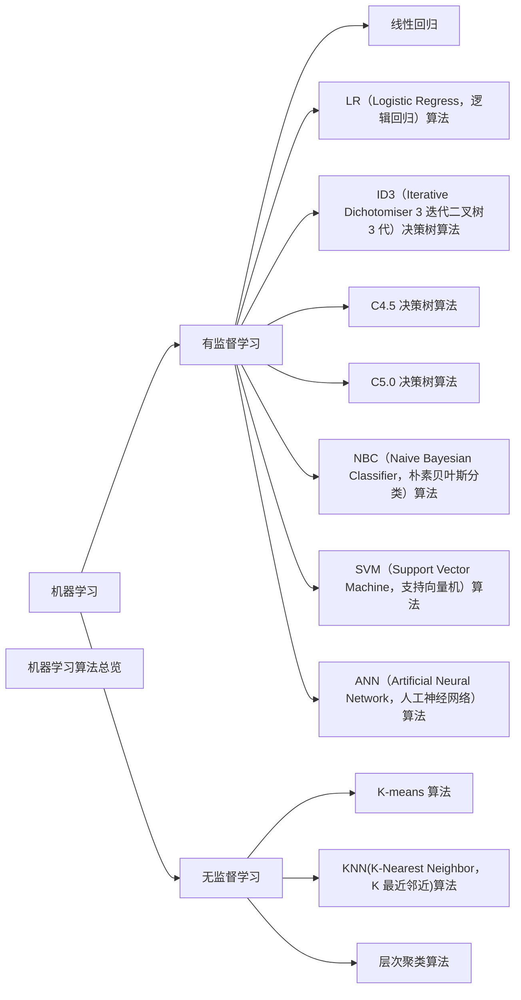

## 名词解释

1. **样本数据**：已经知道结果的历史数据，每一条独立的数据叫做样本。例如：一条用 户基本信息数据,包括：姓名、年龄、性别、出生地、职业、手机号。 
2. **特征**：对模型训练、预测产生影响的因素称为特征。如：年龄、性别、出生地、职业。数据集：用于训练模型前准备的初始数据。 
3. **训练集**：用于模型构建，在数据集中获取部分样本，用于训练模型中使用的数据称为训练集。 
4. **测试集**：测试集是用于生成模型后对模型进行测试调参优化模型的数据集。 
5. **模型**：算法能学习到训练样本数据中变量和目标值之间的函数关系，我们把学习到的这个函数关系叫做模型。 
6. **算法**：能够对训练集的输入，通过内部既定的数据公式获得所要求的输出模型，得到模型的过程公式称为算法

## 几种常见的分类算法

分类是在一群已经知道类别标号的样本中，训练一种分类器，让其能够对某种未知的样本进行分类。分类算法属于一种有监督的学习。分类算法的分类过程就是建立一种分类模型来描述预定的数据集或概念集，通过分析由属性描述的数据库元组来构造模型。分类的目的就是使用分类对新的数据集进行划分，其主要涉及分类规则的准确性、过拟合、矛盾划分的取舍等。

### 按监督分类

#### 有监督机器学习

1. 线性回归
2. LR（Logistic Regress，逻辑回归）算法
3. ID3（Iterative Dichotomiser 3 迭代二叉树3 代）决策树算法
4. C4.5 决策树算法
5. C5.0 决策树算法
6. NBC（Naive Bayesian Classifier，朴素贝叶斯分类）算法
7. SVM（Support Vector Machine，支持向量机）算法
8. ANN（Artificial Neural Network，人工神经网络）算法

#### 无监督学习

1. K-means 算法
2. KNN(K-Nearest Neighbor，K 最近邻近)算法
3. 层次聚类算法

## NBC（Naive Bayesian Classifier，朴素贝叶斯分类）算法

NBC 模型发源于古典数学理论，有着坚实的数学基础。该算法是基于条件独立性假设的一种算法，当条件独立性假设成立时，利用贝叶斯公式计算出其后验概率，即该对象属于某一类的概率，选择具有最大后验概率的类作为该对象所属的类。

### NBC 算法的优点

1. NBC 算法逻辑简单，易于实现；
2. NBC 算法所需估计的参数很少；
3. NBC 算法对缺失数据不太敏感；
4. NBC 算法具有较小的误差分类率；
5. NBC 算法性能稳定，健壮性比较好；

### NBC算法的缺点

1. 在属性个数比较多或者属性之间相关性较大时，NBC 模型的分类效果相对较差；
2. 算法是基于条件独立性假设的，在实际应用中很难成立，故会影响分类效果

## LR（Logistic Regress，逻辑回归）算法

LR 回归是当前业界比较常用的机器学习方法，用于估计某种事物的可能性。它与多元线性回归同属一个家族，即广义线性模型。简单来说多元线性回归是直接将特征值和其对应的概率进行相乘得到一个结果，逻辑回归则是在这样的结果上加上一个逻辑函数。在此选择LR 作为回归分析模型的代表进行介绍。

### LR算法的优点

1. 对数据中小噪声的鲁棒性好；
2. LR 算法已被广泛应用于工业问题中；
3. 多重共线性并不是问题，它可结合正则化来解决。

### LR算法的缺点

1. 对于非线性特征，需要转换
2. 当特征空间很大时，LR的性能并不是太好

## SVM（Support Vector Machine，支持向量机）算法

SVM 算法是建立在统计学习理论基础上的机器学习方法，为十大数据挖掘算法之一。通过学习算法，SVM 可以自动寻找出对分类有较好区分能力的支持向量，由此构造出的分类器可以最大化类与类的间隔，因而有较好的适应能力和较高的分准率。SVM 算法的目的在于寻找一个超平面H，该超平面可以将训练集中的数据分开，且与类域边界的沿垂直于该超平面方向的距离最大，故SVM 法亦被称为最大边缘算法。

### SVM算法的优点

1. SVM 模型有很高的分准率；
2. SVM 模型有很高的泛化性能；
3. SVM 模型能很好地解决高维问题；
4. SVM 模型对小样本情况下的机器学习问题效果好。

### SVM算法的缺点

1. SVM 模型对缺失数据敏感；
2. 对非线性问题没有通用解决方案，得谨慎选择核函数来处理。

## 决策树

决策树模型呈树形结构，在分类问题中，表示基于特征对数据进行分类的过程。它可以认为是if-then规则的集合。每个内部节点表示在属性上的一个测试，每个分支代表一个测试输出，每个叶节点代表一种类别。

### 实例

下面就以一个经典的打网球的例子来说明如何构建决策树。

我们今天是否去打网球（play）主要由天气（outlook）、温度（temperature）、湿度（humidity）、是否有风（windy）来确定。样本中共14条数据。

| NO. | Outlook | temperature | humidity | windy | play |
| --- | --- | --- | --- | --- | --- |
| 1 | sunny | hot | high | FALSE | no |
| 2 | sunny | hot | high | TRUE | no |
| 3 | overcast | hot | high | FALSE | yes |
| 4 | rainy | mild | high | FALSE | yes |
| 5 | rainy | cool | normal | FALSE | yes |
| 6 | rainy | cool | normal | TRUE | no |
| 7 | overcast | cool | normal | TRUE | yes |
| 8 | sunny | mild | high | FALSE | no |
| 9 | sunny | cool | normal | FALSE | yes |
| 10 | rainy | mild | normal | FALSE | yes |
| 11 | sunny | mild | normal | TRUE | yes |
| 12 | overcast | mild | high | TRUE | yes |
| 13 | overcast | hot | normal | FALSE | yes |
| 14 | rainy | mild | high | TRUE | no |

### ID3（Iterative Dichotomiser 3 迭代二叉树3 代）决策树算法

ID3 算法是一种基于决策树的分类算法，该算法是以信息论为基础，以信息熵和信息增益为衡量标准，从而实现对数据的归纳分类。信息增益用于度量某个属性对样本集合分类的好坏程度。ID3 算法的时间复杂度为O(n\*\|D\|\*log\|D\|)。

#### ID3算法的优点

1. ID3 算法建立的决策树规模比较小；
2. 查询速度快。

#### ID3算法的缺点

1. 不适合处理连续数据；
2. 难以处理海量数据集；
3. 建树时偏选属性值较大的进行分离，而有时属性值较大的不一定能反应更多的数据信息。

### C4.5 决策树算法

C4.5 算法是ID3 算法的修订版，采用信息增益率来加以改进，选取有最大增益率的分割变量作为准则，避免ID3 算法过度的适配问题。

#### C4.5算法优点

1. C4.5 继承了ID3 优点；
2. 在树构造过程中进行剪枝；
3. 能对不完整数据进行处理；
4. 能够完成对连续属性的离散化处理；
5. 产生的分类规则易于理解，准确率较高；
6. 用增益率来选择属性，克服了用增益选择属性时偏向选择取值多的属性。

#### C4.5 算法缺点

1. 构造树时，需要对数据集进行多次的顺序扫描和排序，因而导致算法的低效；
2. 只适合于能驻留于内存的数据集，当训练集达到内存无法容纳时程序无法运行。

C4.5 用于遥感分类过程中，首先依据通常的方式建立第一个模型。随后建立的第二个模型聚焦于被第一个模型错误分类的记录。以此类推，最后应用整个模型集对样本进行分类，使用加权投票过程把分散的预测合并成综合预测。Boosting 技术对于噪声不大的数据，通常通过建立的多模型来减少错误分类的影响，提高分类精度。

### C5.0 决策树算法

C5.0 算法是 Quinlan 在C4.5 算法的基础上改进而来的产生决策树的一种更新的算法，它除了包括C4.5 的全部功能外，还引入许多新的技术，其中最重要的技术是提升（Boosting）技术，目的是为了进一步提高决策树对样本的识别率。同时C5.0 的算法复杂度要更低，使用更简单，适应性更强，因此具有更高的使用价值。

#### C5.0算法的优点

1. C5.0 模型能同时处理连续和离散的数据
2. C5.0 模型估计模型通常不需要很长的训练时间；
3. C5.0 引入Boosting 技术以提高分类的效率和精度；
4. C5.0 模型易于理解，模型推出的规则有非常直观的解释；
5. C5.0 模型在面对数据遗漏和特征很多的问题时非常稳健。

#### C5.0算法的缺点

1. 目标字段必须为分类字段。

美国地质调查局(USGS)在进行土地覆盖分类项目过程中研发了支持决策树分类的软件。软件分类模块主要是针对庞大数据量的数据集进行数据挖掘，找出特征，然后建立规则集进行决策分类。在分类模块中采用C5.0 模型来完成决策树分类、形成分类文件，实现遥感影像的分类。

## KNN(K-Nearest Neighbor，K 最近邻近)算法

KNN 算法是Cover 和Hart 于1968 年提出的理论上比较成熟的方法，为十大挖掘算法之一。该算法的思路非常简单直观：如果一个样本在特征空间中的k 个最相似(即特征空间中最邻近)的样本中的大多数属于某一个类别，则该样本也属于这个类别。该方法在定类决策上只依据最邻近的一个或者几个样本的类别来决定待分样本所属的类别。

### KNN算法的优点

1. KNN 算法简单、有效；
2. KNN 算法适用于样本容量比较大的类域的自动分类；
3. 由于KNN 方法主要靠周围有限的邻近的样本，而不是靠判别类域的方法来确定所属类别的，因此对于类域的交叉或重叠较多的待分样本集来说，KNN 方法较其他方法更为适合。

### KNN算法的缺点

1. KNN 算法计算量较大；
2. KNN 算法需要事先确定K 值；
3. KNN 算法输出的可解释不强；
4. KNN 算法对样本容量较小的类域很容易产生误分。

## ANN（Artificial Neural Network，人工神经网络）算法

人工神经网络（ANN）算法就是一组连续的输入/输出单元，其中每个连接都与一个权相关。在学习阶段，通过调整神经网络的权，使得能够预测样本的正确类标号来学习。

### ANN算法的优点

1. 能处理数值型及分类型的属性；
2. 分类的准确度高，分布并行处理能力强；
3. 对包含大量噪声数据的数据集有较强的鲁棒性和容错能力。

### ANN算法的缺点

1. 不能观察之间的学习过程；
2. 学习时间过长，甚至可能达不到学习的目的；
3. 对于非数值型数据需要做大量数据预处理工作；
4. 输出结果难以解释，会影响到结果的可信度和可接受程度；
5. 神经网络需要大量的参数，如网络拓扑结构、权值和阈值的初始值。

## 小结

| 算法名称 | 收敛时间 | 是否过度拟合 | 是否过渡拟合缺失数据敏感度 | 训练数据量 |
| --- | --- | --- | --- | --- |
| NBC | 快 | 存在 | 不敏感 | 无要求 |
| LR | 快 | 存在 | 敏感 | 无要求 |
| SVM | 一般 | 存在 | 敏感 | 小数据量 |
| ID3 | 快 | 存在 | 不敏感 | 小数据集 |
| C4.5 | 快 | 存在 | 不敏感 | 小数据集 |
| C5.0 | 快 | 不存在 | 不敏感 | 大数据集 |
| ANN | 慢 | 存在 | 敏感 | 大数据集 |
| KNN | 快 | 存在 | 敏感 | 数据量多 |

#### 参考网址

[https://blog.csdn.net/songguangfan/article/details/92581643](https://blog.csdn.net/songguangfan/article/details/92581643)
[https://blog.csdn.net/qq_34807908/article/details/81539536](https://blog.csdn.net/qq_34807908/article/details/81539536)